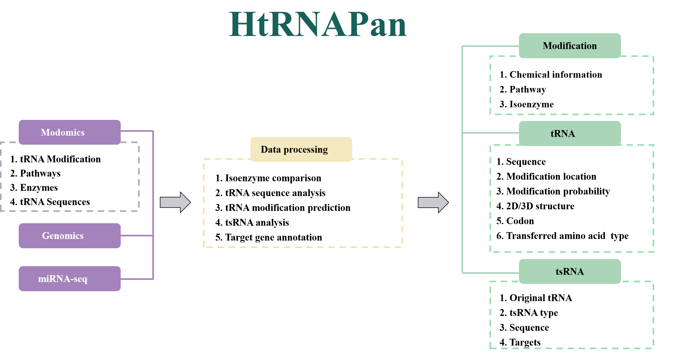

# Data Processing Pipeline for Small RNA Analysis in HtRNAPan

## Introduction 
  HtRNAPan, an integrated platform for comprehensive landscape analysis and functional annotation of herbal tRNAs. The database features: 1) Over 514,119 tRNAs and over 33,417,735 tsRNAs from 315 medicinal plant species. 2) Annotation of over100 tRNA modification enzymes across all species. 3) tRNA sequences with predicted modification types, positions, probabilities. 4) RNA modification isozyme profiles. 5) tsRNA sequences and regulatory roles in cross-kingdom. Users can intuitively explore tRNA panorama data via a user-friendly interface.


**cite from:**  [A novel panorama database for comprehensive analysis and functional annotation of herbal tRNAs](https://www.biorxiv.org/)


## Pipeline Workflow


### 1. Data Download and Cleaning 

Retrieve datasets from the following sources:

- [NCBI](https://www.ncbi.nlm.nih.gov/)

- [Modomics](https://iimcb.genesilico.pl/modomics/)


  For Modomics data, we downloaded the original HTML files and performed data scraping using the Python script in the `01.data_scrape` directory as follows.

  ```sh
  #protein 
  python 01.data_scrape/01.modifications/run.py -i 01.data_scrape/01.modifications/test/1.html -o ./1.json
  
  #modification 
  python 01.data_scrape/02.proteins/run.py -i 01.data_scrape/02.proteins/test/1.html -o ./1.json
  ```
  
### 2.  tRNA Prediction

  Use `tRNAscan-SE` to predict tRNA from  Genomes.
  
  ```sh
  tRNAscan-SE  -E -o ${genome}.tRNA -f ${genome}.structure --thread 16 ${genome} 
  ```

### 3.  tRNA 2D and 3D Structure Prediction

Predict 2D and 3D Structures Using the [VfoldPipeline_alone](https://rna.physics.missouri.edu/vfoldPipeline/index.html).

### 4.  tRNA Modification Prediction

 After downloading modified and unmodified tRNA sequences from Modomics, first use a script to extract the positions and types of modifications, then classify them according to amino acid types. Next, perform data alignment between the sequence to be predicted and sequences of the same amino acid type, and extract the modification ratios.
   ```sh
   #extract the positions and types of modifications from sequences
   python 03.tRNA_mod/seq2mod.py 

   #align tRNA sequences and extract modification percentage
   muscle -align all.fa -output aln.afa   
   python 03.tRNA_mod/seq2modpos.py  -s  aln.afa -m modification_sites.tsv -min 5 -o out -minP 0.2
   ```

### 5.  Analysis of Modification-Related Isozymes

Predict modified-related isozymes using `miniprot`.
```sh
miniprot --gff -Iut50 ${genome} ${pep} > miniprot.gff
grep -v '^#' miniprot.gff|gffread -  -g ${genome} -y ${species}.proteins.fa
```
 
### 6.  tsRNA Mining and Target Gene Prediction
Use blastn to align the miRNA-Seq data to the tRNA sequences, and then use a script to organize the tsRNA data.

```
makeblastdb -in tRNA.fa -dbtype nucl -out tRNA_db
blastn -query miRNA_R1.fasta -db tRNA_db -out R1_vs_tRNA.blastout -outfmt 6  -a 32  -evalue 1e-5
blastn -query miRNA_R2.fasta -db tRNA_db -out R1_vs_tRNA.blastout -outfmt 6  -a 32  -evalue 1e-5 
perl 04.tsRNA/tsRNA-pipeline.pl miRNA tRNA.fa

RNAhybrid -c -p 0.05 -s 3utr_human -t 3utr_sequences.fa -f 2,7 -e -30 -b 1  -q tsRNA.fa >out

``` 
